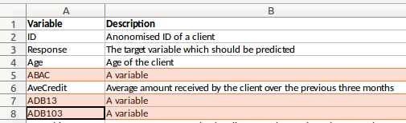
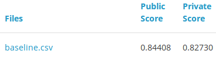
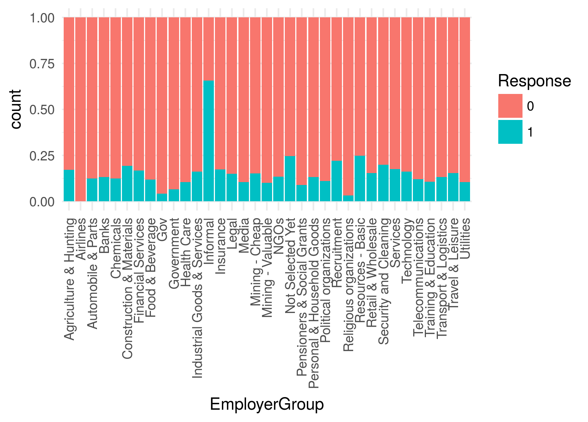
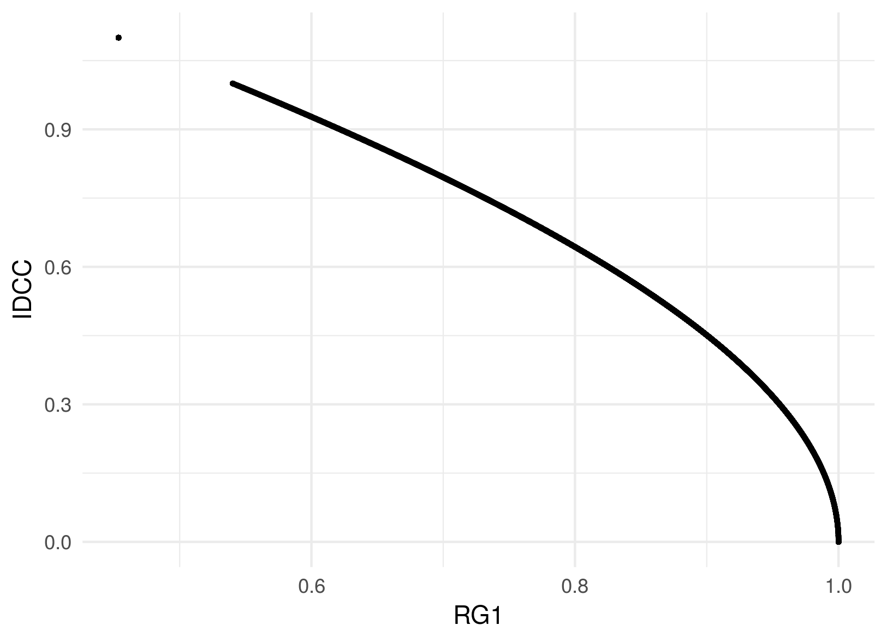
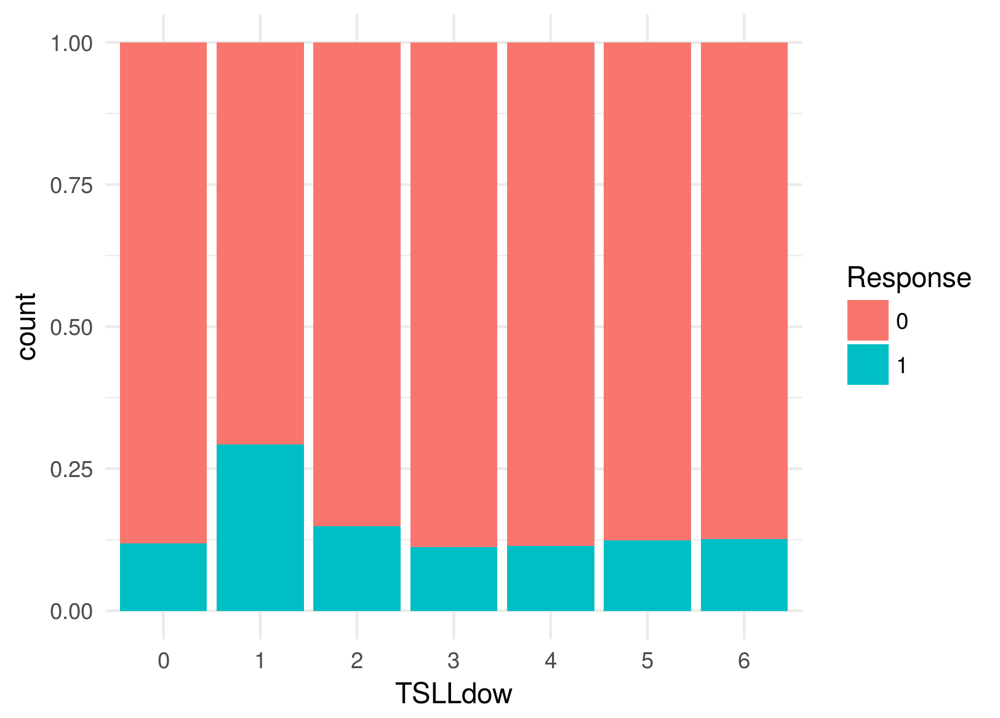
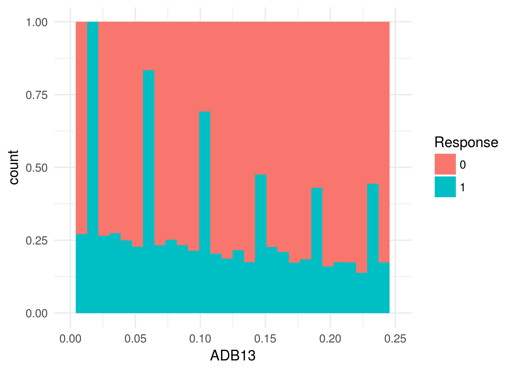
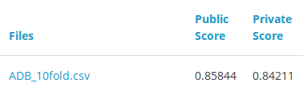
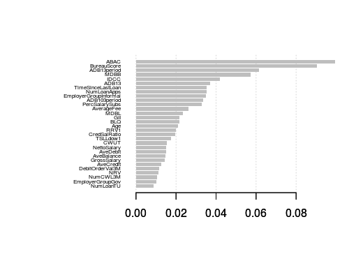
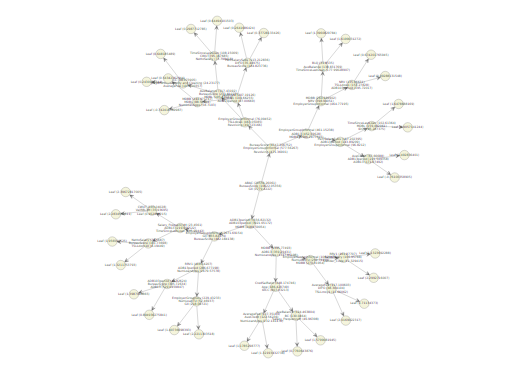

class: inverse

```{r setup, include=FALSE}
options(htmltools.dir.version = FALSE)
library(tidyverse)
```

# Outline

--
1. Introduction

--

2. Methodology:

    - Data Preprocessing
    - Baseline Model - `xgboost`
    - Feature Engineering
    - Final Prediction

--
3. Insights

--

4. Conclusion

---

# Introduction

--

- **Goal:** predict which clients are likely to start experiencing financial strain.

--

- Output evaluated with ranking measure, AUC.

--

- We treat it as a binary classification problem.

- Output interpreted as the likelihood of experiencing financial strain, can then rank clients.

--

- **Challenge:** We don't know the meaning of most of the variables - makes feature engineering hard!

---
class: center, middle



---

layout: true

### Methodology

---

## Preprocessing

--

- Decide on variable types:

    - Character variables -> categorical
    - Variables with 2 unique values -> binary
    - The rest -> continuous
    - Luckily tree based methods are quite robust to these choices.

- One-hot encode the categorical variables (dummy variables).
    
--

- Remove `RID` and `RTSV1` since they are not in the test data.

--

- Missing values:

    - For tree based methods, it's usually sufficient if the missing values are well separated from other values.
    - `Salary_Frequency` `NA`s treated as another class.
    - `AveCredit` and `AveDebit` both had many -99 values. Since `AveDebit` < 0, changed its -99 to 99.

---

## Baseline Model

--

- First fit a strong baseline to which I can compare future changes.
- Chose the `xgboost` package for gradient boosted trees.

    - I have experience with boosting.
    - `xgboost` proven very effective in Kaggle competitions, especially with structured/tabular data.
    
--

- No hyperparameter tuning - too time consuming + improvements are limited.
- Chose parameters intuitively, after testing a few.

    - `max_depth = 5`, small learning rate, early stopping, subsample by column and row (0.8).
    
---

## Baseline Model

- Evaluate with 5-fold cross-validation.

    - keep the split fixed for future models, for fair comparisons.
    - 10-fold gives more accurate results, but more time consuming.
    
--
    
- Predictions on test: average of the predictions of model trained on each training subset.

.center[

]

- Would've placed me second in the competition.

---

## Feature Engineering

- process: try something, evaluate, keep or reject

---

## Feature Engineering
### Small Improvements

--

- Grouped all the 'Gov-...' employer groups together.

---
layout: false
class: center, middle



---
layout: true

### Methodology

---

## Feature Engineering
### Small Improvements

- Grouped all the 'Gov-...' employer groups together.

- Made two mining groups: 'cheap' and 'valuable'.

--

- added new feautres for:

    - percentage salary subtractions
    - percentage loans not taken up
    - Average credict vs nett salary ratio
    - split `PDU` in 3

--

- removed `RG1` because of this relationship with `IDCC`.
  
---
layout: false
class: center, middle



---
layout: true

### Methodolgy

---

## Feature Engineering
### Big Improvements

- `TimeSinceLastLoan`

    - created a DOW, DOM, MOY features.
    - Why did it work?

---
layout: false
class: center, middle



---
layout: true

### Methodolgy

---

## Feature Engineering
### Big Improvements

- `ADB13` and `ADB103`

    - Look at the cyclical structure.
    
---
layout: false
class: center, middle



---
layout: true

### Methodolgy

---

## Feature Engineering
### Big Improvements

- `ADB13` and `ADB103`

    - Look at the cyclical structure.
    - Did not know how to capture it, unevenly spaced.
    - Divided by (1/92) and took the decimal values; close to 1 means close to peak.
    
---

## Feature Engineering

- Results after feature engineering:



- 1st place!

---
## Final Prediction

--

- Created two more models, `max_depth = 3` and `max_depth = 7`, trained on different cv splits.

- Weighted average

--

- Psuedo-labelling -> limited improvement, probably not worth it

--

- None of these made a big difference.

--

- Final Score:


---
layout: false

# How can we use this model in practice?

- `xgboost` give very accurate results and also very efficient:

    - training time $\approx$ 1.4 minutes on 31500 observations
    - prediction time $\approx$ 0.48 seconds on 3500 observations
    
- However, some refer to it as a black box (magic)

- one thing we get for free is the feature importance:

---

# How can we use this model in practice?



- Tells us how many times `xgboost` found a feature useful to split on.
- Did not work as a feature selection tool.

---

# How can we use this model in practice?

Also nice to investigate this 'multi-tree' plot.



Shows the top three most frequent splits at each node.

---

# How can we use this model in practice?

.pull-right[Compare rank with true output - quite accurate!]

```{r, echo=FALSE, message=FALSE, warning=FALSE}
rank_df <- read_csv('rank_df.csv')
rank_df %>% arrange(-prob) %>% head(20)
```

---

# Conclusion

- Main contributions to solution:

    - `xgboost` 
    - feature engineering

- More possibilities if we know the meaning of the variables.

- Model is useful for deployment.

---

class: center, middle, inverse

# Thank you!

---

class: center, inverse

# Questions?

<br>
<br>
<br>

--

.pull-down[
## maraisjandre9@gmail.com
## https://github.com/jandremarais/CapitecComp
]