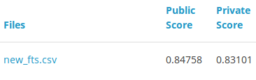
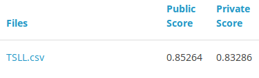
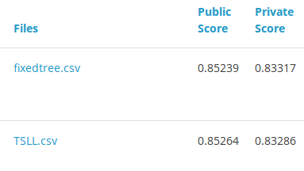
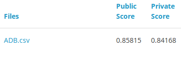

```{r setup, include=FALSE}
knitr::opts_chunk$set(echo = TRUE, message = FALSE, warning = FALSE)
```

# Introduction 

This is my winning solution to the Capitec Data Science Competition hosted on [Kaggle](https://inclass.kaggle.com/c/capitec-bblb). The goal was to predict which clients are likely to start experiencing financial strain.

# Data Preprocessing

First, I brief look at the data.

```{r}
library(tidyverse)
library(readr)

train_data <- read_csv('data/TrainData.csv') %>% as.data.frame()
test_data <- read_csv('data/TestData.csv') %>% as.data.frame()

print(paste("#", c("rows", "columns"), "in training data:", dim(train_data)))
print(paste("#", c("rows", "columns"), "in test data:", dim(test_data)))
```

The columns in training data that are not in test:

```{r}
colnames(train_data)[!(colnames(train_data) %in% colnames(test_data))]
```

Let's keep `Response` separate and remove `RTSV1` and `RID`, since they don't appear in the test data. Also, keep the observation ID's in a separate vector.

```{r}
train_ids <- train_data$ID
test_ids <- test_data$ID

y <- train_data$Response

train_data <- train_data %>% 
  select(-RID, -RTSV1, -Response, -ID)
test_data <- test_data %>% select(-ID)
```

Now we can combine the training and test datasets so that we only have to do the data manipulations once.

```{r}
all_data <- bind_rows(train_data, test_data)
```

Next, find out the variable types in the data. Basically we just want to distinguish between the continuous and discrete variables. When doing a simple `str(all_data)` command, we notice that some variables that appear to be categorical are coded as integers and some as characters. Its not trivial to decide which variables should be treated as categorical, ordinal or continuous. One of the major limitations of this data is that we don't know the descriptions of most of the variables. I decided to treat all the variables where the order of its values matters as continuous/numeric variables, and the rest as categorical/factors. This seems to sufficient for tree based methods, which I intend to use. So for now I'll assume all the character variables are categorical, all variables with only two unique values as binary and the rest as continuous. (this is probably not the best way, but hopefully it won't make much of a difference during modelling)

```{r}
cat_vars <- colnames(all_data)[sapply(all_data, class) == "character"]
bin_vars <- colnames(all_data)[sapply(all_data, function(a) length(unique(a)) == 2)]
cat_vars <- cat_vars[!(cat_vars %in% bin_vars)]
num_vars <- colnames(all_data)[!(colnames(all_data) %in% c(cat_vars, bin_vars))]
```

It's not easy finding the missing values for this data since, we don't know how they were coded. The only obvious ones are in the `Salary_Frequency` variable (coded as `NA`). Since it is a categorical variable, we'll just treat it is as another category:

```{r}
all_data$Salary_Frequency[is.na(all_data$Salary_Frequency)] <- "NA"
```

Other strange values, which might be missing value codes, are -99 for AveCredit and AveDebit, and -1 for HB01. Tree based methods should handle these fine if they are well separated from the normal values. So all we have to do is change the -99 for AveDebit to 99 (since AveDebit < 0).

```{r}
all_data$AveDebit[all_data$AveDebit == -99] <- 99
```

# Baseline model

Before any further feature engineering, we'll fit a baseline model to which we can compare to after making furthers changes to the features. I've chosen to use gradient boosted trees with the `xgboost` package since I have plenty of experience using it and it has been proven very successful in most Kaggle competions. The greatest benefit of using `xgboost` is that it is very robust to missing values, feature scaling and redundant features.

For our baseline model, we'll one-hot-encode all the categorical variables.

```{r}
all_data[, cat_vars] <- lapply(all_data[, cat_vars], factor)
all_data[, bin_vars] <- lapply(all_data[, bin_vars], function(a) as.numeric(factor(a)) - 1)
all_data_onehot <- model.matrix(~ . -1, all_data)

# divide again into test and train
train_data <- all_data_onehot[1:length(y), ]
test_data <- all_data_onehot[-(1:length(y)), ]
```

I decided not to heavily fine-tune the `xgboost` parameters. It is very time consuming with usually only marginal improvements. I played with tree depth between 4-10, small learning rate and with early stopping. I also added row and column subsampling to fight overfitting.

To validate our model we'll use 5-fold cross-validation. `xgboost` wants the data in a `xgb.DMatrix`.

```{r, cache=TRUE}
library(xgboost)
xgtest <- xgb.DMatrix(data = test_data)

params <- list(objective = "binary:logistic",
               eta = 0.02,
               subsample = 0.8,
               colsample_bytree = 0.8,
               max_depth = 5,
               eval_metric = 'auc',
               nthread = 2
)

set.seed(123)
cv_folds <- caret::createFolds(factor(y), k = 5, list = TRUE)

cv_out <- lapply(1:length(cv_folds), function(a) 
{
  y_train <- y[-cv_folds[[a]]]
  y_valid <- y[cv_folds[[a]]]

  xgtrain <- xgb.DMatrix(data = train_data[-cv_folds[[a]], ], label = y_train)
  xgvalid <- xgb.DMatrix(data = train_data[cv_folds[[a]], ], label = y_valid)
  
  watchlist <- list(train = xgtrain, valid = xgvalid)
  
  set.seed(321)
  
  start <- Sys.time()
  xgb_model <- xgb.train(params = params, data = xgtrain, nrounds = 2500, print_every_n = 100,
                         watchlist = watchlist, maximize = TRUE, early_stopping_rounds = 100)
  print(Sys.time() - start)
  
  start <- Sys.time()
  prob <- predict(xgb_model, xgtest)
  print(Sys.time() - start)
  score <- xgb_model$best_score
  
  list(prob, score)
})
  
```

The cv-estimate of AUC is:

```{r}
mean(sapply(cv_out, "[[", 2))
```

To make predictions on the test set we average the predictions from the models trained on each of the subsets.

```{r}
ave_prob <- Reduce("+", lapply(cv_out, "[[", 1))

submission <- cbind(test_ids, ave_prob)
colnames(submission) <- c("ID", "Response")
write.csv(submission, file = 'submissions/baseline.csv' , row.names = FALSE)
```


The results:


Pretty decent, would've ranked second with this model.

# Categorical variable encodings

For the baseline model we used one-hot-encodings for the categorical variables. I wanted to try two other approaches [entity embeddings](https://arxiv.org/pdf/1604.06737.pdf) and [weight of evidence](https://www.r-bloggers.com/r-credit-scoring-woe-information-value-in-woe-package/).

## Entity embeddings

The idea here is to feed the categorical variables into a feed forward neural network and let it learn an optimal representation of the variables. This representation can then be given as features to `xgboost`. We want to do this for each train/validation split to prevent data leakage.

```{r}
cat_mat <- all_data_onehot[1:length(y), !(colnames(all_data_onehot) %in% colnames(all_data))]

library(keras)

cat_mat <- all_data_onehot[, !(colnames(all_data_onehot) %in% colnames(all_data))]
cat_mat_test <- cat_mat[-(1:length(y)), ]

cv_out <- lapply(1:length(cv_folds), function(a) 
{
  y_train <- y[-cv_folds[[a]]]
  y_valid <- y[cv_folds[[a]]]
  
  cat_mat_train <- cat_mat[1:length(y),][-cv_folds[[a]], ]
  cat_mat_valid <- cat_mat[1:length(y),][cv_folds[[a]], ]
  
  cat_input <- layer_input(shape = ncol(cat_mat))
  embedding <- cat_input %>% 
    layer_dense(64) %>% layer_batch_normalization() %>% layer_activation('relu') %>% 
    layer_dense(32) %>% layer_batch_normalization() %>% layer_activation('relu') 
  out <- embedding %>% 
    layer_dense(1, activation = 'sigmoid')
  ee_model <- keras_model(cat_input, out)
  
  ee_model %>% compile(
    loss = 'binary_crossentropy',
    optimizer = optimizer_adam(lr=0.0005),
    metrics = c('accuracy')
  )
  
  set.seed(456)
  h <- ee_model %>% fit(
    x = cat_mat_train,
    y = y_train,
    epochs = 10, batch_size = 256
  #validation_data = list(lapply(cat_vars, function(a) valid_data[, a]), list(y_valid))
  )
  
  train_embeddings <- predict(ee_model, cat_mat_train)
  valid_embeddings <- predict(ee_model, cat_mat_valid)
  test_embeddings <- predict(ee_model, cat_mat_test)
  
  new_train <- as.matrix(cbind(train_data[-cv_folds[[a]], c(num_vars, bin_vars)], train_embeddings))
  new_valid <- as.matrix(cbind(train_data[cv_folds[[a]], c(num_vars, bin_vars)], valid_embeddings))
  new_test <- as.matrix(cbind(test_data[, c(num_vars, bin_vars)], test_embeddings))
  
  xgtrain <- xgb.DMatrix(data = new_train, label = y_train)
  xgvalid <- xgb.DMatrix(data = new_valid, label = y_valid)
  xgtest <- xgb.DMatrix(data = new_test)
  
  watchlist <- list(train = xgtrain, valid = xgvalid)
  
  set.seed(321)
  xgb_model <- xgb.train(params = params, data = xgtrain, nrounds = 2500, print_every_n = 100,
                         watchlist = watchlist, maximize = TRUE, early_stopping_rounds = 100)
  
  prob <- predict(xgb_model, xgtest)
  score <- xgb_model$best_score
  
  list(prob, score)
})
```

The cv-estimate of AUC is:

```{r}
mean(sapply(cv_out, "[[", 2))
```

which is much worse than the baseline.

## WOE

```{r}
library(Information)

cv_out <- lapply(1:length(cv_folds), function(a) {
  #a = 1
  y_train <- y[-cv_folds[[a]]]
  y_valid <- y[cv_folds[[a]]]
  
  infoTables <- create_infotables(
  data = cbind(all_data[1:length(y), cat_vars][-cv_folds[[a]], ], y = y_train), 
  y = "y",
  bins = 10,
  ncore = 2,
  parallel = T)

  all_data_woe <- all_data
  
  for(var in names(infoTables$Tables)){
    IT_per_var <- infoTables$Tables[[var]][, c(1,4)]
    
    for(tag in IT_per_var[, var])
    {
      all_data_woe[, var][all_data_woe[, var] == tag] <- IT_per_var$WOE[IT_per_var[, var] == tag]
    }
    all_data_woe[, var] <- as.numeric(all_data_woe[, var])
  }
  
  xgtrain <- xgb.DMatrix(data = as.matrix(all_data_woe[1:length(y), ][-cv_folds[[a]], ]), label = y_train)
  xgvalid <- xgb.DMatrix(data = as.matrix(all_data_woe[1:length(y), ][cv_folds[[a]], ]), label = y_valid)
  xgtest <- xgb.DMatrix(data = as.matrix(all_data_woe[-(1:length(y)), ]))
  
  watchlist <- list(train = xgtrain, valid = xgvalid)
  
  set.seed(321)
  xgb_model <- xgb.train(params = params, data = xgtrain, nrounds = 2500, print_every_n = 100,
                         watchlist = watchlist, maximize = TRUE, early_stopping_rounds = 100)
  
  prob <- predict(xgb_model, xgtest)
  score <- xgb_model$best_score
  
  list(prob, score)
})

```

The cv-estimate of AUC is:

```{r}
mean(sapply(cv_out, "[[", 2))
```

which is again worse than the baseline. One more thing we can try is to give the categorical variables integer codes - might save some time.

```{r}
all_data_ints <- all_data
all_data_ints[, cat_vars] <- lapply(all_data_ints[, cat_vars], function(a) as.numeric(a) - 1)

# divide again into test and train
train_data <- all_data_ints[1:length(y), ]
test_data <- all_data_ints[-(1:length(y)), ]
```


```{r, cache=TRUE}
xgtest <- xgb.DMatrix(data = as.matrix(test_data))

set.seed(123)
cv_folds <- caret::createFolds(factor(y), k = 5, list = TRUE)

cv_out <- lapply(1:length(cv_folds), function(a) 
{
  y_train <- y[-cv_folds[[a]]]
  y_valid <- y[cv_folds[[a]]]

  xgtrain <- xgb.DMatrix(data = as.matrix(train_data[-cv_folds[[a]], ]), label = y_train)
  xgvalid <- xgb.DMatrix(data = as.matrix(train_data[cv_folds[[a]], ]), label = y_valid)
  
  watchlist <- list(train = xgtrain, valid = xgvalid)
  
  set.seed(321)
  xgb_model <- xgb.train(params = params, data = xgtrain, nrounds = 2500, print_every_n = 100,
                         watchlist = watchlist, maximize = TRUE, early_stopping_rounds = 100)
  
  prob <- predict(xgb_model, xgtest)
  score <- xgb_model$best_score
  
  list(prob, score)
})
  
```

The cv-estimate of AUC is:

```{r}
mean(sapply(cv_out, "[[", 2))
```

Therefore we will stick with one-hot encoding!

# Feature engineering

## Employer Groups

Bin the government employer groups in more more coarse categories.

```{r}
all_data[, cat_vars] <- lapply(all_data[, cat_vars], as.character)

all_data$EmployerGroup[substr(all_data$EmployerGroup, 1, 3) == "Gov" & 
                         all_data$EmployerGroup != "Government"] <- "Gov"

all_data$EmployerGroup[all_data$EmployerGroup %in% c("Mining - Gold", "Mining - Iron Ore", "Mining - Platinum", "Mining - Precious Stones")] <- "Mining - Valuable"
all_data$EmployerGroup[all_data$EmployerGroup %in% c("Mining - Coal", "Mining & Quarrying", "Oil, Gas & Petroleum")] <- "Mining - Cheap"

all_data[, cat_vars] <- lapply(all_data[, cat_vars], factor)

all_data_onehot <- model.matrix(~ . -1, all_data)

# divide again into test and train
train_data <- all_data_onehot[1:length(y), ]
test_data <- all_data_onehot[-(1:length(y)), ]
```

```{r, cache=TRUE}
xgtest <- xgb.DMatrix(data = test_data)

set.seed(123)
cv_folds <- caret::createFolds(factor(y), k = 5, list = TRUE)

cv_out <- lapply(1:length(cv_folds), function(a) 
{
  y_train <- y[-cv_folds[[a]]]
  y_valid <- y[cv_folds[[a]]]

  xgtrain <- xgb.DMatrix(data = train_data[-cv_folds[[a]], ], label = y_train)
  xgvalid <- xgb.DMatrix(data = train_data[cv_folds[[a]], ], label = y_valid)
  
  watchlist <- list(train = xgtrain, valid = xgvalid)
  
  set.seed(321)
  xgb_model <- xgb.train(params = params, data = xgtrain, nrounds = 2500, print_every_n = 500,
                         watchlist = watchlist, maximize = TRUE, early_stopping_rounds = 100)
  
  prob <- predict(xgb_model, xgtest)
  score <- xgb_model$best_score
  
  list(prob, score)
})
  
```

The cv-estimate of AUC is:

```{r}
mean(sapply(cv_out, "[[", 2))
```

Small improvement on the baseline.

And on the test set?

```{r}
ave_prob <- Reduce("+", lapply(cv_out, "[[", 1))

submission <- cbind(test_ids, ave_prob)
colnames(submission) <- c("ID", "Response")
write.csv(submission, file = 'submissions/employ.csv' , row.names = FALSE)
```


Also a tiny improvement. We shouldn't do model selection on the test AUC. We run the risk of overfitting. This is just to show that our validation accuracy is relatively similar to the test AUC. Also for interest sake.

## Create more feature combinations

Since `xgboost` is mostly robust to redundant features, we can create more features from combining the original features and see if they improve the model. These features are just that make intuitive sense to me to have an influence on loan delinquency. Unfortunately we can only work with those that we have a description of.

```{r}
all_data <- all_data %>% 
  mutate(
    #NumLoanPending = NumLoanApps - NumLoanNTU - NumLoanTU,
    PercLoanTU = ifelse(NumLoanTU != 0, NumLoanTU/(NumLoanTU + NumLoanNTU), 0),
    PercSalarySubs = (GrossSalary - NettoSalary)/GrossSalary,
    #AveDiff = AveCredit + AveDebit,
    #AveDiffDiff = AveBalance - AveDiff,
    #NetSal_AveCred_Diff = NettoSalary - AveCredit,
    CredSalRatio = AveCredit/NettoSalary
    
    
  ) 

#num_vars <- c(num_vars, c("NumLoanPending", "PercLoanTU", "PercSalarySubs", "AveDiff", 
#                          "AveDiffDiff", "NetSal_AveCred_Diff", "CredSalRatio"))

num_vars <- c(num_vars, c("PercLoanTU", "PercSalarySubs", "CredSalRatio"))
```


I tried other linear combinations, but felt decision trees already take that into account.

```{r}
all_data %>% 
  ggplot(aes(RG1, IDCC)) + geom_point(size = 0.5) + theme_minimal()
  ggsave('RG1.png')
```


```{r}
all_data_onehot <- model.matrix(~ . -1, all_data)

# divide again into test and train
train_data <- all_data_onehot[1:length(y), ]
test_data <- all_data_onehot[-(1:length(y)), ]
```

```{r, cache=TRUE}
xgtest <- xgb.DMatrix(data = test_data)

set.seed(123)
cv_folds <- caret::createFolds(factor(y), k = 5, list = TRUE)

cv_out <- lapply(1:length(cv_folds), function(a) 
{
  y_train <- y[-cv_folds[[a]]]
  y_valid <- y[cv_folds[[a]]]

  xgtrain <- xgb.DMatrix(data = train_data[-cv_folds[[a]], ], label = y_train)
  xgvalid <- xgb.DMatrix(data = train_data[cv_folds[[a]], ], label = y_valid)
  
  watchlist <- list(train = xgtrain, valid = xgvalid)
  
  set.seed(321)
  xgb_model <- xgb.train(params = params, data = xgtrain, nrounds = 2500, print_every_n = 500,
                         watchlist = watchlist, maximize = TRUE, early_stopping_rounds = 100)
  
  imp <- xgb.importance(colnames(xgtrain), xgb_model)
  
  prob <- predict(xgb_model, xgtest)
  score <- xgb_model$best_score
  
  list(prob, score, imp)
})
```

The cv-estimate of AUC is:

```{r}
mean(sapply(cv_out, "[[", 2))
```

Another slight improvement. To see which of these newly created variables were important to the model, we can plot the xgboost importance matrix:

```{r}
xgb.plot.importance(cv_out[[1]][[3]][1:40,])
```

We see that the percentage subtractions of salary, credit vs salary ration and percentage of loan taken up are all useful to the model.

```{r}
ave_prob <- Reduce("+", lapply(cv_out, "[[", 1))

submission <- cbind(test_ids, ave_prob)
colnames(submission) <- c("ID", "Response")
write.csv(submission, file = 'submissions/new_fts.csv' , row.names = FALSE)
```

This resulted in a nice bump in test AUC:



However, still not 1st place material.

We need to look finer at the features.

## TimeSinceLastLoan

```{r}
#6 %/% 7
all_data <- all_data %>% 
  mutate(TSLLdow = factor(TimeSinceLastLoan%%7),
         TSLLdom = factor(TimeSinceLastLoan%%30),
         #TSLLdoy = TimeSinceLastLoan%%365,
         #TSLLWeeks = TimeSinceLastLoan%/%7,
         #TSLLMonths = TimeSinceLastLoan%/%31,
         #TSLLYears = TimeSinceLastLoan%/%365,
         TSLLmoy = factor((TimeSinceLastLoan%/%31)%%12))

cat_vars <- c(cat_vars, c("TSLLdow", "TSLLdom", "TSLLmoy", "TSLLwom"))
```

Visualise why it might work:

```{r}
all_data[1:35000, ] %>% 
  ggplot(aes(TSLLdow)) + 
  geom_bar(aes(fill = factor(y)), position = "fill") +
  scale_fill_discrete(name = 'Response') +
  theme_minimal()
```

```{r}
all_data$TSLLwom
all_data[1:35000, ] %>% 
  ggplot(aes(TSLLdom)) + 
  geom_bar(aes(fill = factor(y)), position = "fill") +
  scale_fill_discrete(name = 'Response') +
  theme_minimal()
```

```{r}
all_data_onehot <- model.matrix(~ . -1, all_data)

# divide again into test and train
train_data <- all_data_onehot[1:length(y), ]
test_data <- all_data_onehot[-(1:length(y)), ]
```

```{r, cache=TRUE}
xgtest <- xgb.DMatrix(data = test_data)

set.seed(123)
cv_folds <- caret::createFolds(factor(y), k = 5, list = TRUE)

cv_out <- lapply(1:length(cv_folds), function(a) 
{
  y_train <- y[-cv_folds[[a]]]
  y_valid <- y[cv_folds[[a]]]

  xgtrain <- xgb.DMatrix(data = train_data[-cv_folds[[a]], ], label = y_train)
  xgvalid <- xgb.DMatrix(data = train_data[cv_folds[[a]], ], label = y_valid)
  
  watchlist <- list(train = xgtrain, valid = xgvalid)
  
  set.seed(321)
  start <- Sys.time()
  xgb_model <- xgb.train(params = params, data = xgtrain, nrounds = 2500, print_every_n = 500,
                         watchlist = watchlist, maximize = TRUE, early_stopping_rounds = 100)
  print(Sys.time() - start)
  
  imp <- xgb.importance(colnames(xgtrain), xgb_model)
  
  start <- Sys.time()
  prob <- predict(xgb_model, xgtest)
  print(Sys.time() - start)
  score <- xgb_model$best_score
  
  list(prob, score, imp)
})
```

```{r}
mean(sapply(cv_out, "[[", 2))
```

Another small increase.

```{r}
ave_prob <- Reduce("+", lapply(cv_out, "[[", 1))

submission <- cbind(test_ids, ave_prob)
colnames(submission) <- c("ID", "Response")
write.csv(submission, file = 'submissions/TSLL.csv' , row.names = FALSE)
```

On the test set:



```{r}
all_data_onehot <- model.matrix(~ . -1, all_data)

# divide again into test and train
train_data <- all_data_onehot[1:length(y), ]
test_data <- all_data_onehot[-(1:length(y)), ]
```

Since we stop training precisely where the validation AUC is optimised, our validation AUC might be too optimistic. One way to fight this might be to decide on a fixed number of training iterations beforehand, for each training subset. We pick 800.

```{r, cache=TRUE}
xgtest <- xgb.DMatrix(data = test_data)

set.seed(123)
cv_folds <- caret::createFolds(factor(y), k = 5, list = TRUE)

cv_out <- lapply(1:length(cv_folds), function(a) 
{
  y_train <- y[-cv_folds[[a]]]
  y_valid <- y[cv_folds[[a]]]

  xgtrain <- xgb.DMatrix(data = train_data[-cv_folds[[a]], ], label = y_train)
  xgvalid <- xgb.DMatrix(data = train_data[cv_folds[[a]], ], label = y_valid)
  
  watchlist <- list(train = xgtrain, valid = xgvalid)
  
  set.seed(321)
  xgb_model <- xgb.train(params = params, data = xgtrain, nrounds = 800, print_every_n = 500,
                         watchlist = watchlist, maximize = TRUE)
  
  imp <- xgb.importance(colnames(xgtrain), xgb_model)
  
  prob <- predict(xgb_model, xgtest)
  score <- xgb_model$best_score
  
  list(prob, score, imp)
})
```

```{r}
ave_prob <- Reduce("+", lapply(cv_out, "[[", 1))

submission <- cbind(test_ids, ave_prob)
colnames(submission) <- c("ID", "Response")
write.csv(submission, file = 'submissions/fixedtree.csv' , row.names = FALSE)
```

Worse on public and better on private:



## ADB

Final attempt, 'de-period' ADB13 and ADB103.

```{r}
all_data <- all_data %>%
  mutate(ADB103period = (ADB103/(1/92))%%1,
         ADB13period = (ADB13/(1/92))%%1)

num_vars <- c(num_vars, c("ADB103period","ADB13period"))
```

```{r}
all_data <- all_data %>% 
  select(-RG1) %>% 
  mutate(PDU = as.character(PDU)) %>% 
  cbind(PDU = ifelse(do.call("rbind", strsplit(as.character(all_data$PDU), "")) == "Y", 1, 0)) %>% 
  select(-PDU)

cat_vars <- cat_vars[cat_vars != "PDU"]
num_vars <- num_vars[num_vars != "RG1"]
bin_vars <- c(bin_vars, c("PDU.1", "PDU.2", "PDU.3"))
```


```{r}
all_data_onehot <- model.matrix(~ . -1, all_data)

# divide again into test and train
train_data <- all_data_onehot[1:length(y), ]
test_data <- all_data_onehot[-(1:length(y)), ]
```

```{r, cache=TRUE}
xgtest <- xgb.DMatrix(data = test_data)

set.seed(123)
cv_folds <- caret::createFolds(factor(y), k = 10, list = TRUE)

cv_out <- lapply(1:length(cv_folds), function(a) 
{
  a = 1
  y_train <- y[-cv_folds[[a]]]
  y_valid <- y[cv_folds[[a]]]

  xgtrain <- xgb.DMatrix(data = train_data[-cv_folds[[a]], ], label = y_train)
  xgvalid <- xgb.DMatrix(data = train_data[cv_folds[[a]], ], label = y_valid)
  
  watchlist <- list(train = xgtrain, valid = xgvalid)
  
  set.seed(321)
  xgb_model <- xgb.train(params = params, data = xgtrain, nrounds = 2500, print_every_n = 500,
                         watchlist = watchlist, maximize = TRUE, early_stopping_rounds = 100)
  
  imp <- xgb.importance(colnames(xgtrain), xgb_model)
  
  prob <- predict(xgb_model, xgvalid)
  
  prob <- predict(xgb_model, xgtest)
  score <- xgb_model$best_score
  
  list(prob, score, imp)
})
```

```{r}
mean(sapply(cv_out, "[[", 2))
```

Another small increase.

```{r}
ave_prob <- Reduce("+", lapply(cv_out, "[[", 1))

submission <- cbind(test_ids, ave_prob)
colnames(submission) <- c("ID", "Response")
write.csv(submission, file = 'submissions/ADB_10fold.csv' , row.names = FALSE)
```



Which finally gives us top spot.

10-fold CV will also improve our results a bit, but its slightly more time consuming. However, since we are done with model selection we can run our future models with 10-fold cv to squeeze out the extra AUC increases.

10-fold cv results


## Ensemble

One way to always improve performance is to take an ensemble of models. Here, I'll only use `xgboost` models of different tree depth.

Depth 2:

```{r, cache=TRUE}
set.seed(123)
cv_folds <- caret::createFolds(factor(y), k = 10, list = TRUE)

params$max_depth <- 3

cv_out <- lapply(1:length(cv_folds), function(a) 
{
  y_train <- y[-cv_folds[[a]]]
  y_valid <- y[cv_folds[[a]]]

  xgtrain <- xgb.DMatrix(data = train_data[-cv_folds[[a]], ], label = y_train)
  xgvalid <- xgb.DMatrix(data = train_data[cv_folds[[a]], ], label = y_valid)
  
  watchlist <- list(train = xgtrain, valid = xgvalid)
  
  set.seed(321)
  xgb_model <- xgb.train(params = params, data = xgtrain, nrounds = 2500, print_every_n = 500,
                         watchlist = watchlist, maximize = TRUE, early_stopping_rounds = 100)
  
  imp <- xgb.importance(colnames(xgtrain), xgb_model)
  
  prob <- predict(xgb_model, xgtest)
  score <- xgb_model$best_score
  
  list(prob, score, imp)
})
```

```{r}
mean(sapply(cv_out, "[[", 2))
```

```{r}
ave_prob <- Reduce("+", lapply(cv_out, "[[", 1))

submission <- cbind(test_ids, ave_prob)
colnames(submission) <- c("ID", "Response")
write.csv(submission, file = 'submissions/depth3_10fold.csv' , row.names = FALSE)
```

Depth 8:

```{r, cache=TRUE}
params$max_depth <- 8

set.seed(123)
cv_folds <- caret::createFolds(factor(y), k = 10, list = TRUE)

cv_out <- lapply(1:length(cv_folds), function(a) 
{
  y_train <- y[-cv_folds[[a]]]
  y_valid <- y[cv_folds[[a]]]

  xgtrain <- xgb.DMatrix(data = train_data[-cv_folds[[a]], ], label = y_train)
  xgvalid <- xgb.DMatrix(data = train_data[cv_folds[[a]], ], label = y_valid)
  
  watchlist <- list(train = xgtrain, valid = xgvalid)
  
  set.seed(321)
  xgb_model <- xgb.train(params = params, data = xgtrain, nrounds = 2500, print_every_n = 500,
                         watchlist = watchlist, maximize = TRUE, early_stopping_rounds = 100)
  
  imp <- xgb.importance(colnames(xgtrain), xgb_model)
  
  prob <- predict(xgb_model, xgtest)
  score <- xgb_model$best_score
  
  list(prob, score, imp)
})
```

```{r}
mean(sapply(cv_out, "[[", 2))
```

```{r}
ave_prob <- Reduce("+", lapply(cv_out, "[[", 1))

submission <- cbind(test_ids, ave_prob)
colnames(submission) <- c("ID", "Response")
write.csv(submission, file = 'submissions/depth8_10fold.csv' , row.names = FALSE)
```

Since they perform slightly worse than with depth 5, I'll give them a slight lower weight in the ensemble:

```{r}
prob3 <- read_csv('submissions/depth3.csv')
prob5 <- read_csv('submissions/ADB_10fold.csv')
prob8 <- read_csv('submissions/depth8.csv')

ens_prob <- 0.25 * prob3$Response +  0.5 * prob5$Response + 0.25 * prob8$Response

submission <- cbind(test_ids, ens_prob)
colnames(submission) <- c("ID", "Response")
write.csv(submission, file = 'submissions/ensemble358_10fold.csv' , row.names = FALSE)
```

## Psuedo-labelling

```{r}
params$max_depth <- 5
params$objective <- "reg:linear"

y_pl <- c(y, ave_prob/5)

set.seed(123)
cv_folds <- caret::createFolds(y_pl, k = 5, list = TRUE)

cv_out <- lapply(1:length(cv_folds), function(a) 
{
  y_train <- y_pl[-cv_folds[[a]]]
  y_valid <- y_pl[cv_folds[[a]]]

  xgtrain <- xgb.DMatrix(data = all_data_onehot[-cv_folds[[a]], ], label = y_train)
  xgvalid <- xgb.DMatrix(data = all_data_onehot[cv_folds[[a]], ], label = y_valid)
  
  watchlist <- list(train = xgtrain, valid = xgvalid)
  
  set.seed(321)
  xgb_model <- xgb.train(params = params, data = xgtrain, nrounds = 2500, print_every_n = 500,
                         watchlist = watchlist, maximize = TRUE, early_stopping_rounds = 100)
  
  imp <- xgb.importance(colnames(xgtrain), xgb_model)
  
  prob <- predict(xgb_model, xgtest)
  score <- xgb_model$best_score
  
  list(prob, score, imp)
})
```

```{r}
mean(sapply(cv_out, "[[", 2))
```

```{r}
ave_prob <- Reduce("+", lapply(cv_out, "[[", 1))

submission <- cbind(test_ids, ave_prob)
colnames(submission) <- c("ID", "Response")
write.csv(submission, file = 'submissions/PL.csv' , row.names = FALSE)
```


